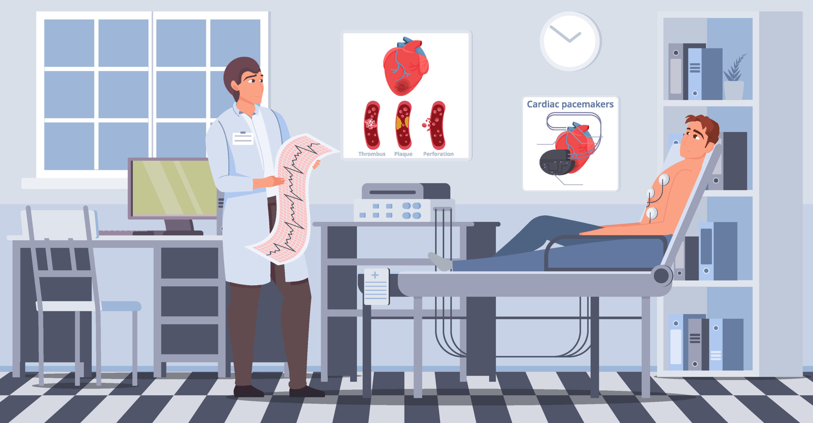

# **PORTFOLIO**

<h2 style="color: blue"> PYTHON</h2>

 

 
<h3><a style="font-weight:bold" href="Projects/Forecasting_Taxes_Nicaragua.html">6. Time Series Forecast - Nicaragua's Government Taxes Revenues.</a></h3>

 

 

 
<h3><a style="font-weight:bold" href="Projects/Apartments_for_Rent.html">5. Apartments for rent in Rome</a></h3>

 

<h3><a style="font-weight:bold" href="Projects/Nicaragua's-Municipality-Elections-Resultsm.html">4. Nicaragua's Municipality Elections Result</a></h3>

 

 

<h3><a style="font-weight:bold" href="Projects/Inversión Pública Nicaragua.html">3. Nicaragua Public Investment Program Analysis</a></h3>

 

 

 
<h3><a style="font-weight:bold" href="Projects/Cardiovascular_Disease_Analysis.html">2. Cardiovascular Disease Analysis</a></h3>

 

 
<h3><a style="font-weight:bold" href="Building_data_web.html">1. Building a dataset from files published on a website</a></h3>

 

 

 <h2 style="color: blue">TABLEAU</h2>

 
<h3><a style="font-weight:bold" href="https://public.tableau.com/app/profile/lilqasr88">1. Tableau Public profile</a> </h3>

 
<h3><a style="font-weight:bold" href="https://public.tableau.com/app/profile/ep2ea">2. Others</a> </h3>

 

 

   <h2 style="color: blue"> SQL</h2>

<h3><a style="font-weight:bold" href="Projects/Analyzing_my_Spotify_historical_Data_part-1.html">1. My Last Year Spotify streaming data</a> </h3>

<h3><a style="font-weight:bold" href="Projects/My_entire_Spotify_streaming_history.html">2. What My Entire Spotify Streaming History Says about me?</a> </h3>

 
 <h3><a style="font-weight:bold" href="Projects/European_football_games.html">2. European Football Games</a> </h3>
 

 
 

 
